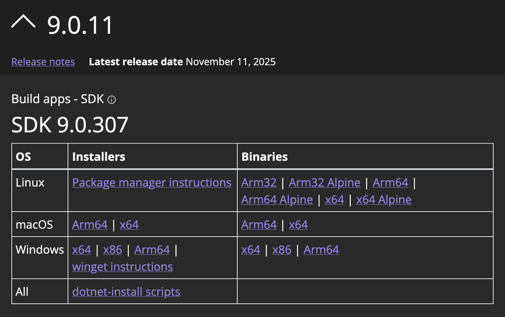
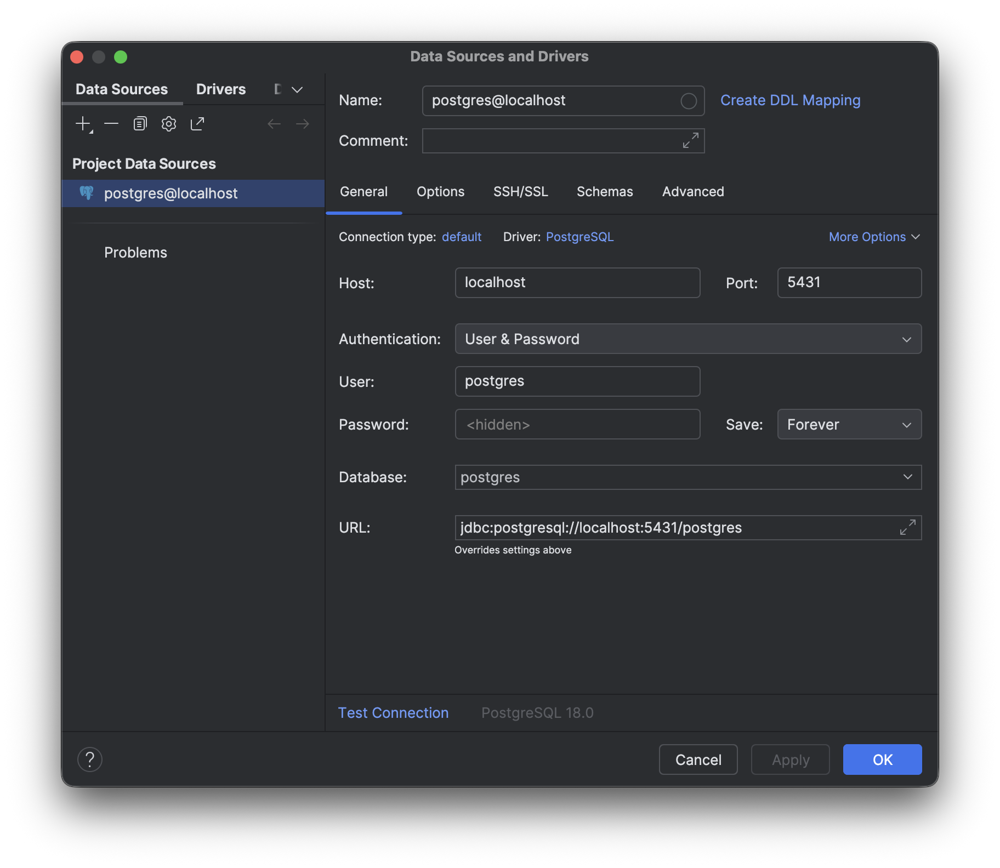

# Visible

## Communication channel

- Discord (https://discord.gg/pRyF8kXgvA)

## Shared Google folder

- https://drive.google.com/drive/u/4/folders/0AOaIp1x9vWR4Uk9PVA

### Contributors:

- Amy Caufield
- Alexander Hilliard
- Roman Little
- Matthew McCusker

---

# Beta Release

Our current release is labelled with the tag `v0.1.0-beta`.

# User Guide

- Please refer to our [User Guide](docs/user_guide.md) for instructions on how to use Visible, as well as an updated record of implemented features and known bugs.

---

# Developer Guide

## Obtaining Source Code

- Option 1: Clone the repository:

        git clone https://github.com/MRU-F2025-COMP3504/3504-term-project-visible.git

- Option 2: Fork the repository (on GitHub), and then clone your fork of the project:

        git clone https://github.com/YOUR_USERNAME/FORKED_REPOSITORY_NAME.git

## Directory Structure Overview

### visible

The visible directory is the root of our application's source code. It holds the React front-end project, as well as the .NET server-side and unit testing projects.

<!-- prettier-ignore -->
| Directory | Overview | Notable Folders|
|:---------:|:--------:|:--------------:|
| _visible.Server_ | This is our server-side project for the back-end API endpoints. | _Configurations:_ Provides infrastructure to include Docker secrets as part of the application's configuration properties. |
| | | _Controllers:_ Contains the controller classes that define our API endpoints. |
| | | _Data:_ Contains SQL files used for database initialization and test-data population. |
| _visible.Services_ | This server-side project contains utilities not directly related to servicing web requests. | _Data:_ Contains custom classes meant to serve as wrappers for the `NpgsqlConnection` and `NpgsqlCommand` utilities, in order to facilitate unit testing of database functionality. |
| | | _Interfaces:_ Defines contracts for the various data accessor types, categorized by feature type (e.g., Authentication, Businesses, Influencer). |
| | | _Models:_ Contains classes defining the types of objects that are expected to be sent to/received from the database. |
| | | _Repositories:_ Contains the concrete implementations of our various data accessors types. |
| _visible.Tests_ | `visible.Tests` is the unit testing project for the **visible.Server** and **visible.Services** projects. | _ControllerTests:_ Contains test for for API endpoint functionality. |
| | | _Models:_ Contains utilities required for unit testing, but not production. |
| | | _Services:_ Contains test files for data accessor functionality. |
| _visible.client_ | Contains source files and assets for the web application project. | _src:_ Contains the react source code used to build and implement views for end users |
| | | _src/assets:_ Contains general media files (such as images) used by the web application (does not include specific assets, such as a user's profile picture). |
| | | _src/components:_ Contains react components meant to implement the structure and behaviour of the web application, and their test files. |
| | | _src/modules:_ Contains auxiliary files that define behaviour the behaviour and structure of data used in the projects react components, such as a module to compartmentalize interactions with the project's database APIs. |

## How to Build Visible

This project utilizes **Docker** to containerize the application and database.

**Note:** This project has been designed so that it should be able to build and run on Windows, Mac, and Linux systems. Please ensure that you have the dependencies installed on your system as outlined below.

### System Requirements

<!-- prettier-ignore -->
| Dependency | Minimum Version (if known) | Source | Notes |
|:----------:|:---------------:|:------:| :----|
| Docker Desktop |  | [Docker.com](https://www.docker.com/get-started/) | After installation, you will need to sign in to your Docker account. If you need to create one, you can do so using your Google or GitHub credentials. |
| .NET | 9.0 | [Download .NET 9.0](https://dotnet.microsoft.com/en-us/download/dotnet/9.0) | Select the appropriate installer for your system's architecture:  |
| Node.js & npm | Node: 22, npm: 11 | [NodeJS](https://nodejs.org/en/download) |
| Python (pip) | python3 |  | pip is required to install `pre-commit` |

### Configuring Local Secrets

- In a terminal, navigate to the repository's `visible` directory, and make a directory called `secrets`:

        mkdir secrets

- Create the following secret files:

<!-- prettier-ignore -->
| Secret | Command to Create | Notes |
| :-------:| --------------- | :---- |
| **postgres_user_password** | `echo [your-password] > secrets/postgres_user_password` | This file is only for your machine, and should not be added to the repository. The password can be anything you want. |
| **HTTPS Certificate & Key** | `dotnet dev-certs https --export-path secrets/visible.client.pem --format Pem --no-password` | The front-end application utilizes HTTPS, so this command will generate development certificates. |
| **JwtIssuer** | `echo "localhost" > secrets/JwtIssuer` |
| **JwtKey** | `echo "a-string-secret-at-least-256-bits-long" > secrets/JwtKey` | |

- **Note:** If you have run any of the above commands in Powershell, you may need to swap the file encoding from `UTF-16LE` to `UTF-8` to ensure compatability.

### Build the Docker Containers

- Open **Docker Desktop**, and ensure that you are signed in to your Docker account.
- In a terminal, navigate to the `visible` directory (`path-to-local/3504-term-project-visible/visible`).
- Start the Docker containers by running the following command:

        docker compose up --build --watch

- **Note:** If you've previously built the project and have made changes, run the following commands:

        docker compose down
        docker compose up --build --watch

- You should now be able to view the project. Visit https://localhost:5173 in your browser to see the result.

### Populating the Database with Test Data

- In order to add data to your instance of the database, please configure a new Postgres connection as shown in the following image.



- **Note:** You will need to authenticate using the `postgres_user_password` from your local secrets.
- We have provided sample data in the `seed.sql` file (found in **visible.Server/Data/**). This will not populate by default, so your tables will be initialized, but empty at startup.

## How to Contribute to Visible

- In order to contribute to visible, you will need to have `pre-commit` installed.

### Set Up Pre-Commit

- This project is using `pre-commit` to enforce C# code styling prescriptively set via `CSharpier`. From the repository's root (`3504-term-project-visible`), install `pre-commit` using the following commands:

        pip3 install pre-commit
        pre-commit install

### Using Pre-Commit

- When you attempt to create a commit (`git commit -m "..."`), pre-commit will validate that any changed C# files are conforming to the code styles outlined. If it detects failures, it will modify the files appropriately, and abort the commit. You must then accept the changes by adding the modified files using `git add`, and re-attempt the commit.

- `pre-commit` can be run at any time using the following command:
  pre-commit run
  - **Note:** pre-commit will only validate files that are currently staged.

### Front End Developement

This project uses **npm** (node package manager) to manage dependencies required by front-end components.

These dependecies are intentionally **excluded** from the repository, via the .gitignore file. **They should not be added to the repository.**

- They are installed by docker when hosting the project.

The package.json file lists these dependencies, and _is_ included in the repository. It allows all dependencies to be easily installed to a local environment.

- Node and npm can be installed via the [NodeJS](https://nodejs.org/en/download) website.

- Once Node/npm are installed, before performing front-end development, navigate to the visible/visible.client directory and execute the following command:

        npm i

This should install all depencies listed in package.json to the local environment, allowing your IDE to index the libraries used in the project.

They consist of a directory 'node_modules/' and a file 'package-lock.json'.

- **Note:** Missing these files will cause your IDE to flag the use of the npm libraries as an error. If these files are ever missing from your local repository, they can be reinstalled via the above command.

## How to Test Visible

### Running Back-End Tests (xUnit)

- This project utilizes the `xUnit` framework for unit testing the C#/.NET backend.

- Option 1: Run tests in the command line:
  - In a terminal, navigate to the `visible` directory.
  - Run the following command:

            dotnet test

    -Option 2: Use the test utility found in your IDE:

  - Assuming that you have opened the repository in your IDE, you should be able to run the unit tests for `visible.Server` and `visible.Services` by clicking on the test buttons within VSCode or your IDE of choice. With this method, you can control which tests are run at a given time.

### Running Front-End Tests (vitest)

- This project is using vitest to deploy tests for the front end components.

- Several testing libraries have been added in the project for vitest to utilize:
  - React Testing Library
    - user-event
    - jest-dom
  - jsdom

- To run created tests, navigate to the `visible.client` directory in a terminal, then run the following command:

        npm run test

## How to Add Tests to Visible

### Adding an xUnit Test

- Go to `visible.Tests`. The tests are organized into files based on the unit being tested. For example, `Controllers/GigListingsControllerTests.cs` contains the current tests for the `visible.Server/Controllers/GigListingController.cs` file.
- If there is not a test file for the component you want to test, please create a test file in the appropriate directory using the naming convention shown above.

- When creating a should be set up to follow the **Arrange, Act, Assert** pattern, as shown below:

```cs
[Fact]
public async Task Test_CanGetGigListings()
{
    // Arrange
    var mockRepository = new Mock<IGigListingRepository>();
    var gigListings = new List<GigListing>
    {
        new()
        {
                GigId = 1,
                BusinessId = 1,
                BusinessName = "Canela",
                Title = "New Product Launch",
                Description = "We want to hype up this new product on Instagram and YouTube.",
                Location = "Calgary, AB",
                Budget = 1500,
                Requirements = "Minimum 1K followers on Instagram",
                Status = "Open",
                Deadline = new DateTime(2025, 11, 30, 19, 30, 00, DateTimeKind.Local),
        },
        new()
        {
                GigId = 2,
                BusinessId = 2,
                BusinessName = "Bass Pro Shop",
                Title = "Spring into Savings",
                Description = "Test description",
                Location = "Edmonton, AB",
                Budget = 750,
                Requirements = "",
                Status = "Open",
                Deadline = new DateTime(2025, 12, 31, 19, 30, 00, DateTimeKind.Local),
        },
    };
    mockRepository.Setup(r => r.GetRecentGigListings()).ReturnsAsync(gigListings);

    // Act
    var controller = new GigListingsController(mockRepository.Object);
    var result = await controller.Get();

    // Assert
    Assert.IsType<OkObjectResult>(result);
    var okResult = result as OkObjectResult;
    Assert.NotNull(okResult);
}
```

- Ensure that you mock any dependencies as part of the **Arrange** step.

### Adding vitest Tests

- To test a front end component, a test file for that component should be created in the same directory with the following name scheme:

        {component_to_test}.tsx

        {component_to_test}.test.tsx

- Specific instructions to create a test will depend on the component and purpose of the specific test.
  - [Vitest documentation can be found here](https://vitest.dev/guide/)
  - [React Testing Library Documentation can be found here](https://testing-library.com/docs/react-testing-library/intro/)
  - [A video tutorial including simple example component tests can be found here](https://www.youtube.com/watch?v=CxSL0knFxAs)

## Building a Release of Visible

- To generate a new release of _Visible_, the steps required are the same as building for development.

1.  Update your local repository by running `git fetch` and `git pull` as required.
2.  In a terminal, navigate to the root of the repository (`path-to-local/3504-term-project-visible`), and then run the following command:

        docker compose --file visible/compose.yaml up --build --watch

3.  In a browser, navigate to https://localhost:5173. You should now see the most recent changes.
